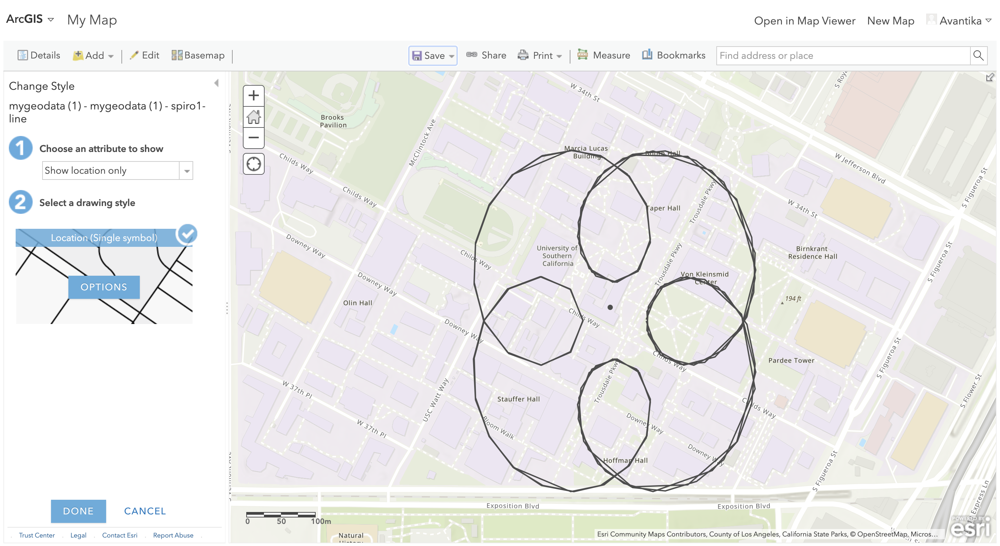

# USC-Odyssey-A-GeoSpatial-Adventure

## Overview

This project delves into the realm of spatial data analysis, visualization, and queries. The goal is to create, visualize, and manipulate geo-spatial data related to 13 locations on the USC campus and my dorm room. The project spans tasks such as creating a KML file, executing spatial queries using Postgres+PostGIS, visualizing data with Google Earth and OpenLayers, and eventually creating a Spirograph curve around Tommy Trojan.

## Steps

### 1. Data Generation and KML Creation

- **Table of Locations:**
   Three locations each of libraries, eateries, water fountains and department buildings have been recorded around the campus.

  | Location Name                   |  Longitude  |  Latitude |
  |---------------------------------|-------------|----------|
  | Leavey Library                  | -118.283273 | 34.021643 |
  | Doheny Library                  | -118.284206 | 34.020280 |
  | Science and Eng Library         | -118.288937 | 34.019427 |
  | Rock & Reily                    | -118.284149 | 34.024143 |
  | Parkside Dining                 | -118.291203 | 34.018614 |
  | Ronald Tutor Centre             | -118.286008 | 34.020616 |
  | Generations Fountain            | -118.283282 | 34.022273 |
  | Cinematics Fountain             | -118.286413 | 34.023482 |
  | Tommy Trojan Fountain           | -118.285177 | 34.020304 |
  | School of Accounting            | -118.285881 | 34.019207 |
  | Roski Architecture School       | -118.287356 | 34.019531 |
  | Herman Ostrow Dentistry School  | -118.285765 | 34.023601 |   
  | Home                            | xxx         | xxx       |

- **KML File:**
  The provided `.kml` file includes 13 placemarks, each representing a location with a label and coordinates. It forms the basis for further visualizations.

### 2. Google Earth Visualization

- **Google Earth Screenshot:**
  Loaded the KML file into Google Earth, capturing a visual representation of the sampled locations on the globe.

  

### 3. Postgres+PostGIS Spatial Queries

- **Convex Hull:**
  Executed a spatial query to compute the convex hull for the 13 points, ensuring a tight, enclosing boundary. Updated the KML file to include the convex hull polygon.

  

- **Nearest Neighbors:**
  Utilized the spatial function of the database to find the four nearest neighbors of the dorm room. Represented the results with line segments in the KML file.

  

### 4. OpenLayers Visualization

- **HTML5 localStorage:**
  Employed OpenLayers, a JavaScript API, to visualize the sampled locations. Stored and loaded points using HTML5 localStorage for persistent data.

### 5. Spirograph™ Curve around Tommy Trojan

- **Spirograph™ Curve:**
  Created a set of spatial coordinates along a Spirograph™ curve around Tommy Trojan using parametric equations. Generated a new KML file and converted it into an ESRI shapefile for visualization on ArcGIS Online.
 
 

## Repository Contents

1. **data_locations_table.csv**: CSV file containing the table of locations.
2. **sample_locations.kml**: KML file with 13 placemarks.
3. **convex_hull.kml**: Updated KML file with convex hull polygon.
4. **nearest_neighbors.kml**: Updated KML file with line segments to four nearest neighbors.
5. **OL.html**: OpenLayers HTML file for visualization.
6. **spirograph_curve.kml**: KML file containing Spirograph™ curve points.
7. **spirograph_curve_shapefile.zip**: Shapefile for ArcGIS Online visualization.
8. **screenshots**: Folder containing screenshots for documentation.

## How I Handled GeoSpatial Data

This project showcases a step-by-step approach to handling geo-spatial data. From initial data generation and KML creation to spatial queries, visualizations on Google Earth and OpenLayers, and a creative Spirograph™ curve around Tommy Trojan, each task demonstrates a practical application of spatial data concepts. The code and files provided serve as a comprehensive guide for anyone looking to explore and analyze geo-spatial data in diverse ways.

Feel free to explore, experiment, and enhance this project for your own spatial data adventures!

